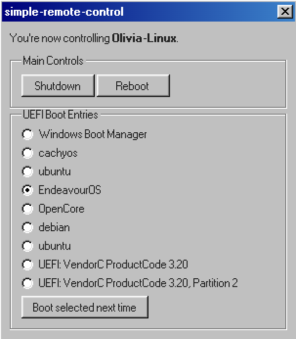

# simple-remote-control



~~Bun script~~ C program that exposes a simple webpage to control the host machine's basic functions like shutdown and reboot.

Linux only for now. I'm not too good with C as you can see.

With `efibootmgr` integration, you can also change the boot order of your system.

## Usage

1. Simply run `make` to build the program.
2. Run the program **as root**. `sudo ./simple-remote-control [port]`
    - If no port is specified, it defaults to `3000`.
    - The program requires root privileges to access system commands like shutdown and reboot.
3. The program will start a web server on the specified port for all interfaces.

## Running as a service

On a systemd system, using a service file is possible to run this program as a service.

An example `/etc/systemd/system/simple-remote-control.service` file:

```ini
[Unit]
Description=Simple Remote Control Service
Wants=network.target
After=network.target

[Service]
Type=simple
ExecStart=/usr/local/bin/simple-remote-control 3000
Restart=on-failure
User=root

[Install]
WantedBy=multi-user.target
```

Then, reload the daemon: `sudo systemctl daemon-reload`\
And enable the service: `sudo systemctl enable simple-remote-control`\
Then start the service: `sudo systemctl start simple-remote-control`

## License

GPL-2.0-only (see [LICENSE](LICENSE))
